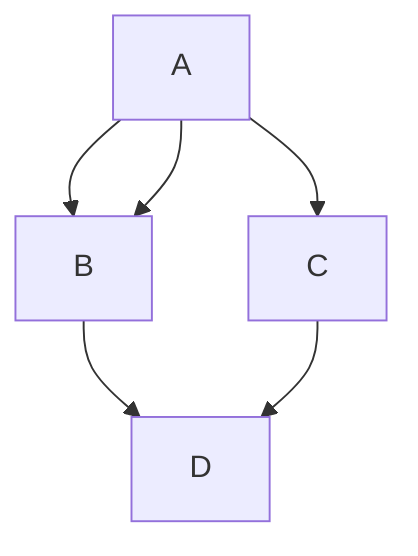

# Material for MkDocs

<https://squidfunk.github.io/mkdocs-material/>

## Install

```bash
pip install mkdocs-material
```

`mkdocs.yml`に以下を追加

```javascript
theme:
    name: 'material'
```

## admonition

<https://squidfunk.github.io/mkdocs-material/extensions/admonition/>

### Install

```bash
pip install mkdocs-material
```

Add the following lines to `mkdocs.yml`:

```yml
markdown_extensions:
    - admonition
```

### Usage

Example:

```markdown
!!! Note
    Note
```

Result:

!!! Note
    Note

## codehilite

```bash
pip install pygments
```

`mkdocs.yml`に以下を追加

```javascript
markdown_extensions:
    - codehilite
```

例

```python
import tensorflow as tf
```

### material

おすすめテーマ

```bash
pip install mkdocs-material
```

### pymdownx

```bash
pip install pymdown-extensions
```

`mkdocs-material` comes with `pymdown-extensions`.

#### arithmatex

inline equation `$r = x\cos\theta$` $r = x\cos\theta$

displayed formulas

```markdown
$$
p(y|x) \propto p(x|y)p(y)
$$
```

$$
p(y|x) \propto p(x|y)p(y)
$$

#### details

```javascript
markdown_extensions:
    - pymdownx.details
```

Usage

```markdown
??? note
    detail
```

??? note
    detail

#### keys

`mkdocs.yml`に以下を追加

```javascript
markdown_extensions:
    - pymdownx.keys
```

Usage

`++ctrl+alt+del++`

++ctrl+alt+del++

キー一覧などの詳細：
<https://facelessuser.github.io/pymdown-extensions/extensions/keys/>

#### [mermaid](mermaid.md)

````markdown


````


