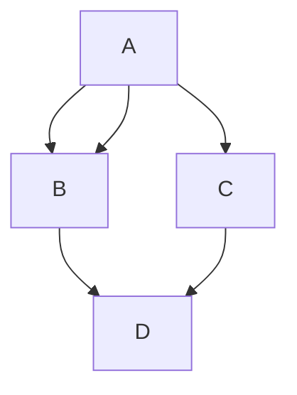
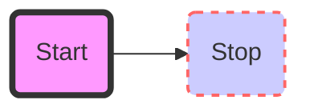
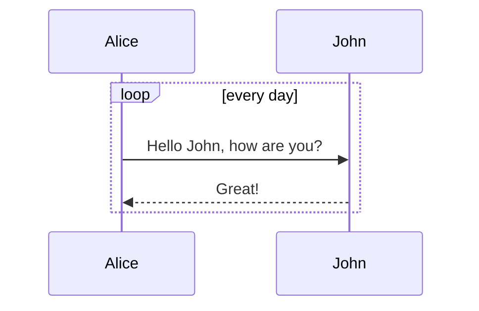

# mermaid

## Flow Chart

````markdown

````


!!! note
    Firefoxだとノードのサイズがいい感じになる。
    Google Chromeだとテキストに対して大きなノードになってしまう。

### Styling

````markdown

````


## Sequence Diagram

````markdown

````


